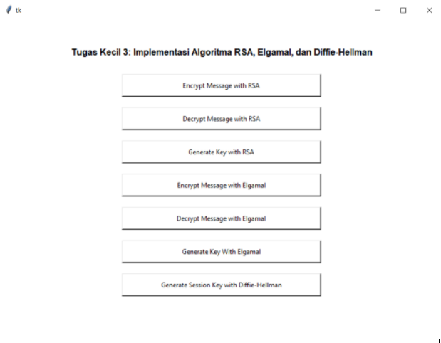
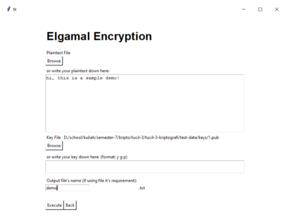
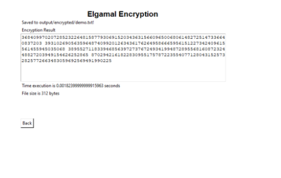
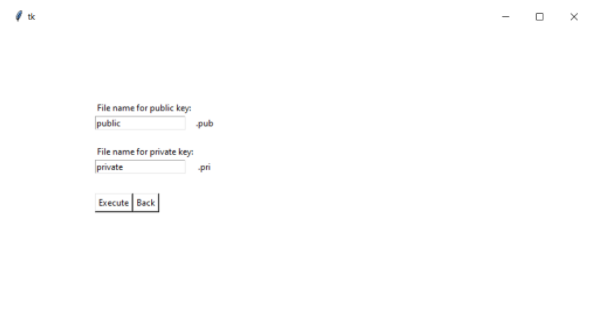
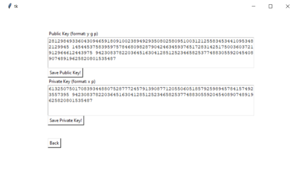

# IF4020 Kriptografi
Tugas kecil 3: Implementasi Algoritma RSA, Elgamal, dan Diffie-Hellman

## Anggota Kelompok
- Ahmad Rizal Alifio    13517076
- Irfan Sofyana Putra   13517078

## Tampilan Antarmuka

<br>


<br>


<br>


<br>



## How to Use
#### Option A: Executable

Jalankan *executable* yang ada pada *root* folder bernama
```
app.exe
```

#### Option B: Installation

1. Lakukan *clone* project ini dengan cara menggunakan perintah
    ```
    git clone https://github.com/irfansofyana/tucil-3-kriptografi.git
    ```
2. Install pustaka *tkinter* pada python. Salah satu tutorialnya ada pada link [berikut](https://tkdocs.com/tutorial/install.html#installwin)

3. Install dependency library dengan menggunakan perintah
    ```
    pip install -r requirements.txt
    ```
4. Jalankan aplikasi pada *root* project dengan menggunakan perintah
    ```
    python app.py
    ```

**Catatan:** Direkomendasikan untuk menggunakan python versi 3 ke atas.
